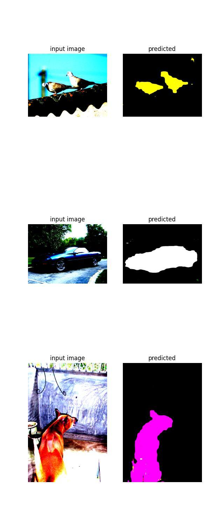

# CMPUT566 Final Project #
# Semantic Segmentation #
## Yifei Lin 1533788 ##



The output colormaps on validation dataset are saved in **/segmenter/val_outputs** and **/MatrixDecomp/val_outputs** respectively.

Please install the dependencies by
```
pip install -r requirements.txt
```
After downloading the **PASCALVOC 2012** dataset, please put **VOCdevkit** inside **/dataset** folder and the train-val dataset VOC2012 and VOC2012_test are following the structure:

- dataset
    - VOCdevkit
        - VOC2012
            - Annotations
            - ImageSets
            - JPEGImages
            - SegmentationClass
            - SegmentationObject
        - VOC2012_test
            - Annotations
            - ImageSets
            - JPEGImages

## Segmenter(Linear and Mask Transformer based) ##
- ### Training and Validation ###
    ```
    python -m segmenter.main [options]
    ```
    Options:

    --model_name: The selected model variant {small_mask, base_mask, small_linear, base_linear}(default: small_linar)

    --lr: Learning rate (default: 1e-6)

    --num_epochs: (default: 10)

    --batch_size: (default: 8)

    --device: Set to be cuda if running on a GPU(default: cpu) 

    --parallel: Use multi-GPUs (default: False)

- ### Inference ###
    The models should be stored inside **segmenter/checkpoints**(my trained models are not uploaded due to the size limit of github)
    ```
    python -m segmenter.inference [options]
    ```

    Options:
    --model_name: The selected model variant {small_mask, base_mask, small_linear, base_linear}(default: small_linar)

    --device: Set to be cuda if running on a GPU(default: cpu) 


## HamNet(Matrix Decomposition) ##
- ### Training and Validation ###
    ```
    python -m MatrixDecomp.main [options]
    ```

    Options:

    --num_layers: Number of layers of the ResNet backbone {50, 101}(default: 50)

    --lr: Learning rate (default: 1e-6)

    --num_epochs: (default: 10)

    --batch_size: (default: 8)

    --device: Set to be cuda if running on a GPU(default: cpu) 

    --parallel: Use multi-GPUs (default: False)


- ### Inference ##
    The models should be stored inside **MatrixDecomp/checkpoints**(my trained models are not uploaded due to the size limit of github)

    ```
    python -m MatrixDecomp.inference [options]
    ```

    Options:

    --num_layers: Number of layers of the ResNet backbone {50, 101}(default: 50)

    --device: Set to be cuda if running on a GPU(default: cpu)


